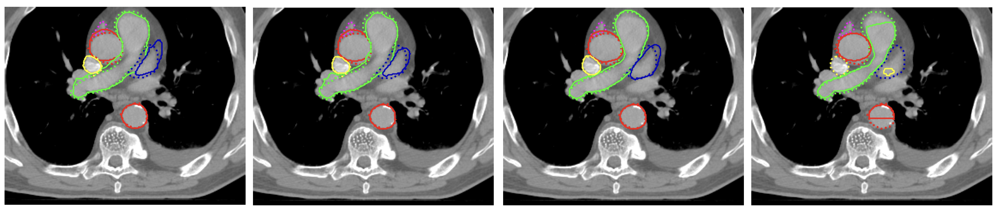
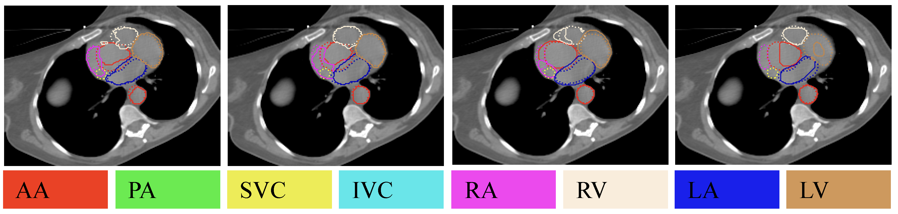

# SMIT-HeartSubSeg

[](https://www.sciencedirect.com/science/article/pii/S2405631626001119)
[](https://arxiv.org/abs/2505.10855)
[](LICENSE)
[](https://www.python.org/)

Code release for transformer-based cardiac substructure segmentation on radiotherapy CT scans.


## Overview

This repository contains the model, training, inference, and analysis code used for cardiac substructure segmentation across lung and breast radiotherapy CT cohorts. The main model is a hybrid SMIT encoder with a convolutional U-Net decoder, evaluated against nnU-Net and TotalSegmentator-based baselines.

## What Is Included

- SMIT model definition and training loop: `models/`, `main_smit.py`, `trainer.py`
- Shared inference script: `run_smit_segmentation.py`
- Convenience run scripts: `run_train_cnc64.sh`, `run_lung_inference.sh`, `run_breast_inference.sh`
- Segmentation scoring utilities: `analysis/metrics/`
- Paper analysis and plotting scripts: `analysis/`
- Lightweight folder placeholders for local data, runs, and checkpoints

## Results




*Representative auto-segmentations across contrast-enhanced (top) and non-contrast (bottom) scans. Columns: SMIT-Balanced, SMIT-Oracle, nnU-Net, and TotalSegmentator.*

## Setup

```bash
conda create -n smit-heartsubseg python=3.9 -y
conda activate smit-heartsubseg
pip install -r requirements.txt
```

The code expects a local dataset mount at `data/AllDatasets`:

```bash
ln -s /path/to/AllDatasets data/AllDatasets
```

See [`data/README.md`](data/README.md) for the expected dataset layout.

Patient images, model checkpoints, score outputs, and metadata are intentionally not versioned. The `.gitignore` is set up so these can exist in a working copy without being pushed.

## Training

A convenience script with all paper hyperparameters is provided:

```bash
bash run_train_cnc64.sh
```

Or invoke `main_smit.py` directly:

```bash
python main_smit.py \
  --data_dir data/AllDatasets \
  --json_list heartsub_master.json \
  --train_split set1_cnc64_training \
  --val_split set1_cnc64_validation \
  --logdir run1_plus_cnc64_inorm \
  --norm_name instance \
  --augmentation_mode adv \
  --a_min -200 --a_max 300 \
  --space_x 1.0 --space_y 1.0 --space_z 3.0 \
  --out_channels 10
```

`--out_channels 10` corresponds to background (0) plus 9 cardiac substructures. Label indices follow Table 1 of the paper: 1 = ascending aorta, 2 = pulmonary artery, 3 = pulmonary vein, 4 = superior vena cava, 5 = inferior vena cava, 6 = right atrium, 7 = right ventricle, 8 = left atrium, and 9 = left ventricle. Adjust to match your label set.

`--augmentation_mode adv` enables nnU-Net-style augmentations (elastic deformation, gamma, mirroring). The alternative `basic` mode uses a lighter augmentation set.

All models were trained on 4 × A100 GPUs for approximately 8 hours, but can be also trained on 2 x A40 GPUs by adjusting batch size and learning rate. Training artifacts are written under `runs/` and are ignored by Git.

## Inference

Lung cohort inference:

```bash
bash run_lung_inference.sh
```

Breast cohort inference:

```bash
bash run_breast_inference.sh
```

Both scripts call `run_smit_segmentation.py` and can be customized through environment variables such as `PRETRAINED_MODEL_PATH`, `OUTPUT_DIR`, `DATASET_JSON`, `DATASET_SPLIT`, `NORM_NAME`, and `OUT_CHANNELS`. By default, they load the Balanced checkpoint at `runs/run1_plus_cnc64_bnorm/model_final.pt` with batch normalization and 10 output channels.

Self-supervised pretraining weights and fine-tuned inference checkpoints are available for download [here](https://mskcc.box.com/s/it3pbmmi9ctd53uej2jc9du6jhyd2rng). Place self-supervised `.pth` files under `pretrained_models/` for training with `--use_ssl_pretrained`. Place fine-tuned `.pt` checkpoints under `runs/<run_name>/` and set `PRETRAINED_MODEL_PATH` to the desired checkpoint for inference.

The Box folder includes the default run checkpoint at `runs/run1_plus_bnorm/model_final.pt` and the Balanced checkpoint at `runs/run1_plus_cnc64_bnorm/model_final.pt`. These `bnorm` checkpoints should be used with `NORM_NAME=batch` and `OUT_CHANNELS=10`.

**Bonus:** the Box folder also includes an updated pericardium-aware checkpoint at `runs/run1_peri_plus_cnc64_inorm/model_final.pt`, trained with pericardium as an additional class. Use this `inorm` checkpoint with `NORM_NAME=instance` and `OUT_CHANNELS=11`.

The paper models use 1 mm x 1 mm x 3 mm spacing (`SPACE_Z=3.0`). HU intensity is clipped to [−200, 300]. Adjust via the `SPACE_X`/`SPACE_Y`/`SPACE_Z`, `A_MIN`, and `A_MAX` environment variables if your data differs. Generated segmentations are written under `analysis/results/`.

## Scoring

Example per-structure scoring command:

```bash
python analysis/metrics/score_segmentations.py \
  --dataset lung \
  --classofi aorta \
  --config run1_plus_cnc64_inorm \
  --json_path data/AllDatasets/heartsub_master.json \
  --split set1_cnc64_validation
```

Score CSVs are written under `analysis/results/` and are ignored by Git.

## Analysis Scripts

The `analysis/` folder contains scripts used to reproduce study-level summaries and figures from local score tables and metadata. These scripts assume the same local dataset and result layout described above.

For a folder-level map, see [`analysis/README.md`](analysis/README.md).

## Citation

If you use this code, please cite:

```bibtex
@article{rangnekar2026transformer,
  title={Transformer-based cardiac substructure segmentation from contrast and non-contrast computed tomography for radiotherapy planning},
  author={Rangnekar, Aneesh and Mankuzhy, Nikhil and Willmann, Jonas and Choi, Chloe Min Seo and Wu, Abraham and Thor, Maria and Rimner, Andreas and Veeraraghavan, Harini},
  journal={Physics and Imaging in Radiation Oncology},
  pages={101011},
  year={2026},
  publisher={Elsevier}
}
```

## Acknowledgements

This work was supported by NCI R01CA258821 and the MSK Cancer Center Support Grant NCI P30CA008748. The lung and breast radiotherapy CT cohorts were collected at Memorial Sloan Kettering Cancer Center. This work utilized resources from the High-Performance Computing Group at Memorial Sloan Kettering Cancer Center.

## Questions and Issues

For questions or bug reports, please open a [GitHub issue](../../issues).

## License

This project is licensed under the MIT License. See [LICENSE](LICENSE) for details.
